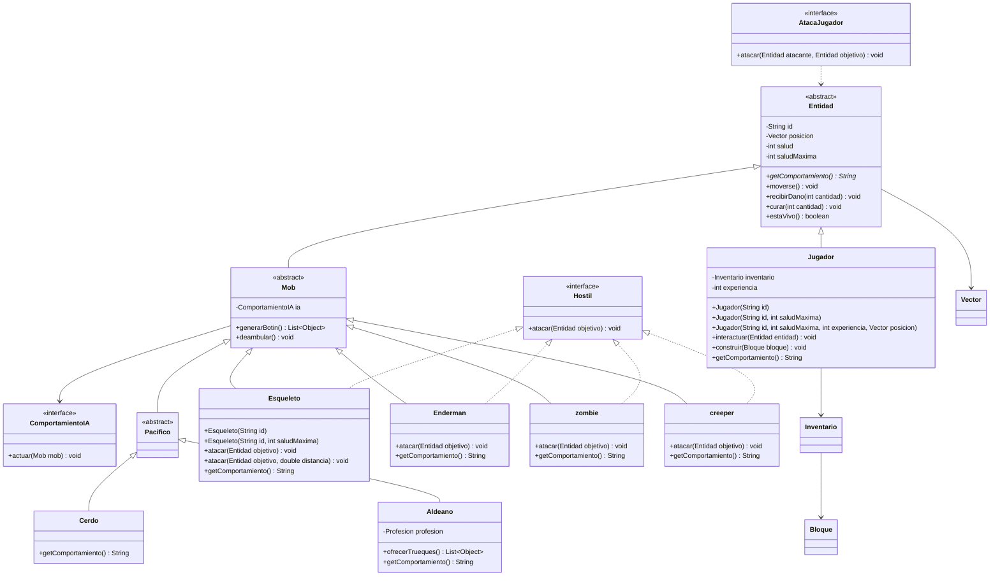

# lfadul-tp-lp3-2026

API REST de ejemplo para representar entidades de Minecraft con Spring Boot,
Maven y Java 21.

## Ejecutar

```bash
cd Minecraft
./mvnw spring-boot:run
```

Endpoints principales:

- `GET /`
- `GET /jugador?id=Alex&saludMaxima=30&experiencia=10&x=1&y=2&z=3`
- `GET /entidades`

## Pruebas

```bash
cd Minecraft
./mvnw test
```

## Modelo del dominio



## Licencia y organización

[Apache License 2.0](LICENSE). Trabajo individual de Lucas Fadul, dominio Minecraft.
Java 21 o superior. El Maven Wrapper está en `Minecraft/`.

Siguiendo el [template](https://github.com/alefq/lp3-template-tp/tree/main/src/main/java/py/edu/uc/lp3), bajo `Minecraft/src/main/java/py/edu/uc/lp3/`:

- `Application.java`: arranque de Spring Boot y escaneo de subpaquetes.
- `domain/`: todas las clases del modelo y sus reglas.
- `rest/controller/`: `IndexController` y `JugadorController`.

## Sobrecarga y sobreescritura

**Sobrecarga:** `Jugador(String)` usa salud 20 y experiencia 0;
`Jugador(String, int)` permite elegir la salud máxima;
`Jugador(String, int, int, Vector)` recibe también experiencia y posición.
Las firmas delegan con `this` y la hija llama a `super(id, saludMaxima)`.
`Esqueleto` y `Cerdo` tienen constructores con id solo (salud 20 y 10)
y con id más salud. `Vector()` y `Vector(double, double, double)` se conservan.

Además, `Esqueleto.atacar(Entidad)` delega en `atacar(Entidad, double)`:
sin distancia se asume 0; con distancia hasta 16 bloques inflige 4 de daño,
y fuera de alcance no hace daño. Una distancia negativa o no finita se rechaza.
Son firmas distintas de la misma acción en la misma clase.

**Sobreescritura:** `Entidad.getComportamiento()` es abstracto.
`Esqueleto` y `Cerdo` implementan la misma firma con textos diferentes;
`Jugador` y las otras entidades concretas también la implementan.
`GET /entidades` devuelve `List<Entidad>`: el JSON incluye `comportamiento`
calculado por cada implementación concreta. El controller usa el tipo padre.

## Reglas y errores HTTP

El constructor valida id no vacío, salud máxima positiva, experiencia no negativa
y coordenadas finitas. El controller construye una instancia nueva con los valores
URL; no asigna vida a mano. El dominio rechaza valores inválidos y el controller
responde HTTP 400 con `{"error":"..."}`. Un número con formato incorrecto también
recibe HTTP 400 por Spring. La salud se mantiene entre 0 y su máximo; daño y
curación negativos se rechazan, y una curación grande no desborda.

```bash
curl http://localhost:8080/
curl 'http://localhost:8080/jugador?id=Alex&saludMaxima=30&experiencia=10&x=1&y=2&z=3'
curl http://localhost:8080/entidades
curl -i 'http://localhost:8080/jugador?saludMaxima=0'
```

El último pedido debe responder 400. Las pruebas verifican construcción, JSON,
polimorfismo, errores del dominio, alcance del ataque y encapsulamiento.
Las especificaciones de entrega están en [docs/ESPECIFICACIONES.md](docs/ESPECIFICACIONES.md).
La asistencia de IA se registra en [BITACORA.md](BITACORA.md).

## Commit de la solución

[Ver solución POO-06](https://github.com/LucasFadul/lfadul-tp-lp3-2026/commit/a3629c95a2755ec82ca19cbc3b7f3c329f4d8bb7)

Este commit contiene código, pruebas y especificaciones. El commit posterior
únicamente incorpora este enlace de entrega.
