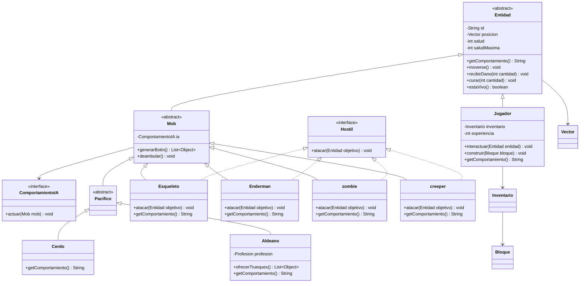

# lfadul-tp-lp3-2026

API REST de ejemplo para representar entidades de Minecraft con Spring Boot,
Maven y Java 21.

## Ejecutar

```bash
cd Minecraft
./mvnw spring-boot:run
```

Endpoints principales:

- `GET /`
- `GET /jugador?id=Alex&saludMaxima=30&experiencia=10&x=1&y=2&z=3`
- `GET /entidades`

## Pruebas

```bash
cd Minecraft
./mvnw test
```

## Modelo del dominio


